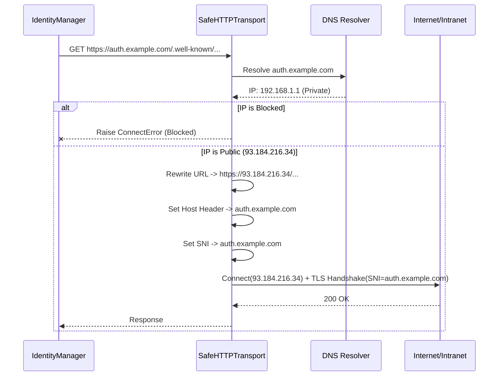

# SafeHTTPTransport: Advanced SSRF & TOCTOU Protection

## 1. Overview

`coreason-identity` now employs a robust, runtime SSRF (Server-Side Request Forgery) and TOCTOU (Time-of-Check Time-of-Use) protection mechanism via a custom `httpx` transport layer: `SafeHTTPTransport`.

Unlike the previous generation, which relied on configuration-time DNS checks (vulnerable to DNS Rebinding), this mechanism enforces security **at the moment of connection establishment**.

## 2. The Vulnerability: DNS Rebinding

In a classic SSRF attack via DNS Rebinding:
1.  **Check Time:** The attacker configures the application with a malicious domain (e.g., `attacker.com`).
2.  **Validation:** The application resolves `attacker.com` to a safe public IP (e.g., `1.2.3.4`) and approves the configuration.
3.  **Use Time:** When the application makes the actual HTTP request, the attacker's DNS server changes the record to point to `127.0.0.1` (localhost) or an internal metadata service (e.g., `169.254.169.254`).
4.  **Exploit:** The HTTP client connects to the internal service, bypassing the initial check.

## 3. The Solution: DNS Pinning & SafeHTTPTransport

`SafeHTTPTransport` eliminates this vulnerability by taking control of the connection process:

1.  **Resolution & Validation:**
    *   Intercepts the request before connection.
    *   Resolves the hostname to an IP address using `socket.getaddrinfo`.
    *   Validates the resolved IP against strict blocklists (Private, Loopback, Link-Local, Multicast, Reserved).
    *   **Fail Closed:** If any resolved IP is blocked, the connection is aborted immediately.

2.  **Connection Pinning:**
    *   **URL Rewriting:** The request URL's hostname is replaced with the validated IP address (e.g., `https://auth.example.com` becomes `https://93.184.216.34`).
    *   **Host Header Preservation:** The `Host` header is manually set to the original hostname (`auth.example.com`) to ensure the server can route the request correctly (Virtual Hosting).

3.  **SNI & SSL Verification:**
    *   Connecting to an IP address typically breaks SSL verification because the certificate is issued for the hostname, not the IP.
    *   `SafeHTTPTransport` utilizes the `sni_hostname` extension in `httpcore` (via `httpx`).
    *   This instructs the underlying SSL context to:
        *   Send the original hostname in the **SNI (Server Name Indication)** extension during the TLS handshake.
        *   Verify the server's certificate against the **original hostname**, not the IP address.

## 4. Configuration & Bypass

This protection is **enabled by default** for all `IdentityManager` instances.

### Unsafe Mode (Local Development)

For local development (e.g., testing against a local Keycloak instance or mock server), the protection can be bypassed.

*   **Configuration:** set `unsafe_local_dev=True` in `CoreasonIdentityConfig`.
*   **Environment Variable:** `COREASON_AUTH_UNSAFE_LOCAL_DEV=True`.
*   **Behavior:** The transport will still perform DNS pinning but will allow connections to private and loopback IP addresses.

## 5. Architecture

